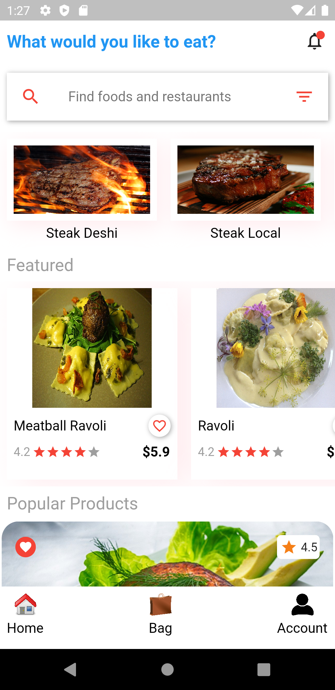
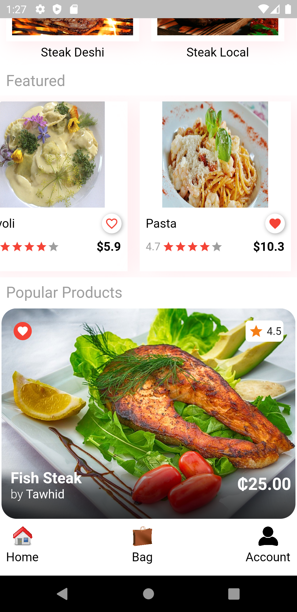
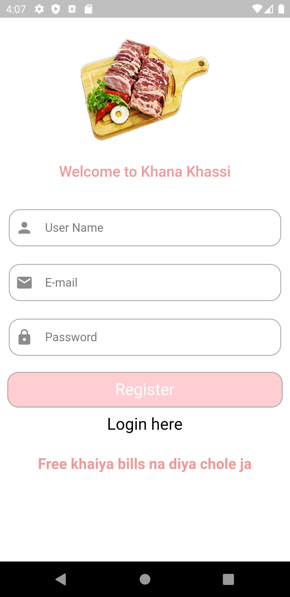
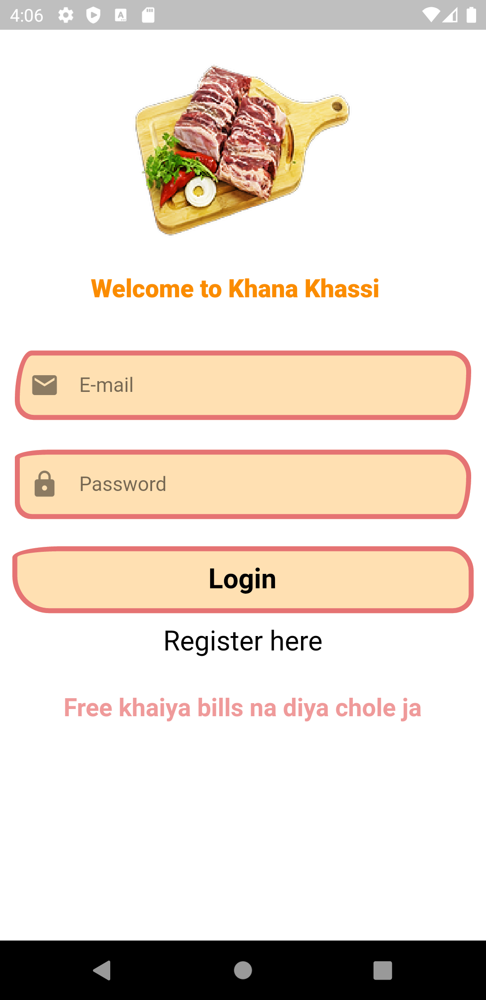
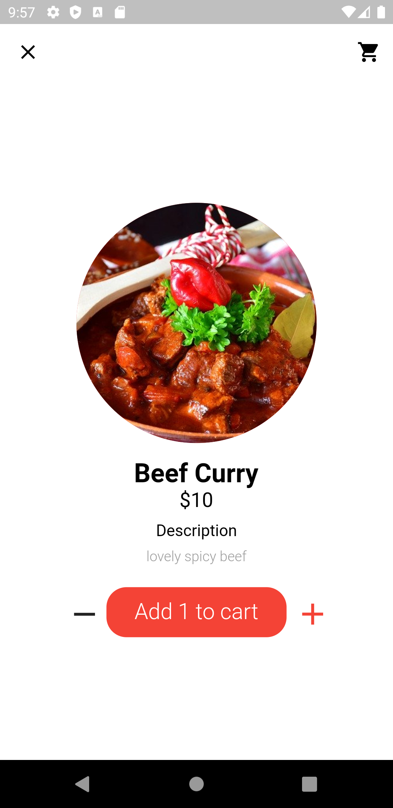
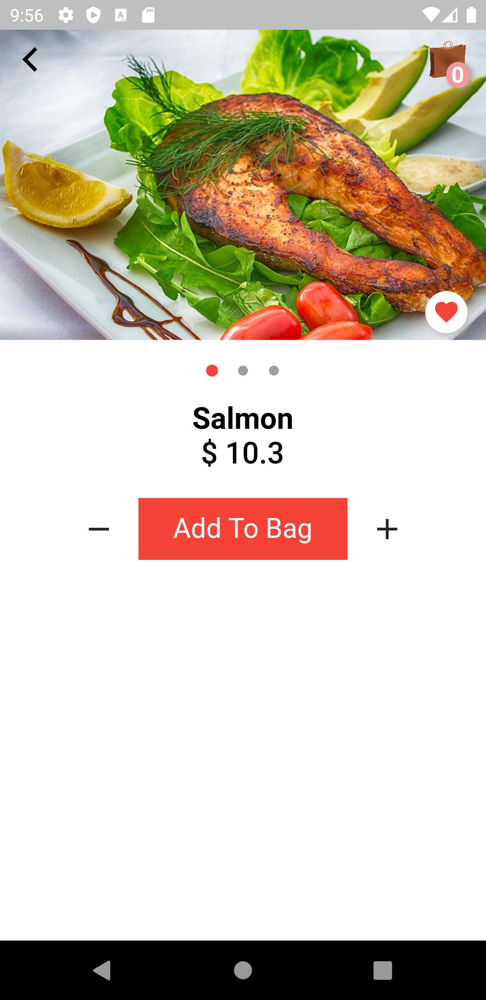
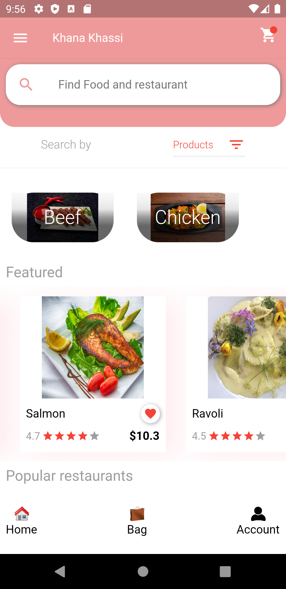

# khana_khassi
## This project is archived as I don't have time to do further development
A food ordering application,
It has three parts.
1. Restaurant owner - List foods and price, Coupon, reward points, featuring.
2. Customer - can book table or order delivery, review,report,rating,share.
3. Admin & App AI - recommendation , banning, featuring, price and product quality based on customer review.

<table>
  <tr>
    <td>Splash UI</td>
     <td>Popular Products</td>
  </tr>
  <tr>
    <td valign="top"></td>
    <td valign="top"></td>
  </tr>
  <tr>
    
  <td>Registration</td>
     <td>Login</td>
  </tr>
  <tr>
  <td valign="top"></td>
  <td valign="top"></td>
  </tr>
  <tr>
    
  <td>Add to Cart</td>
  <td>Order</td>
  <td>Home</td>
  </tr>
  <tr>
  <td valign="top"></td>
   <td valign="top"></td>
   <td valign="top"></td>
  </tr>
  </tr>
  </tr>
  
  </tr>
 </table>
 
 

Please do support if you love my works.
